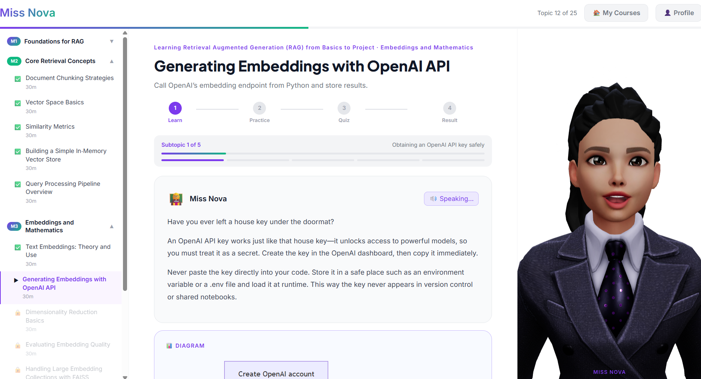
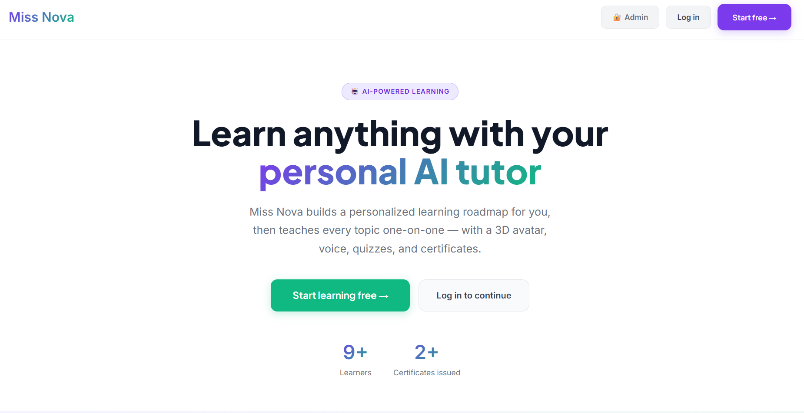
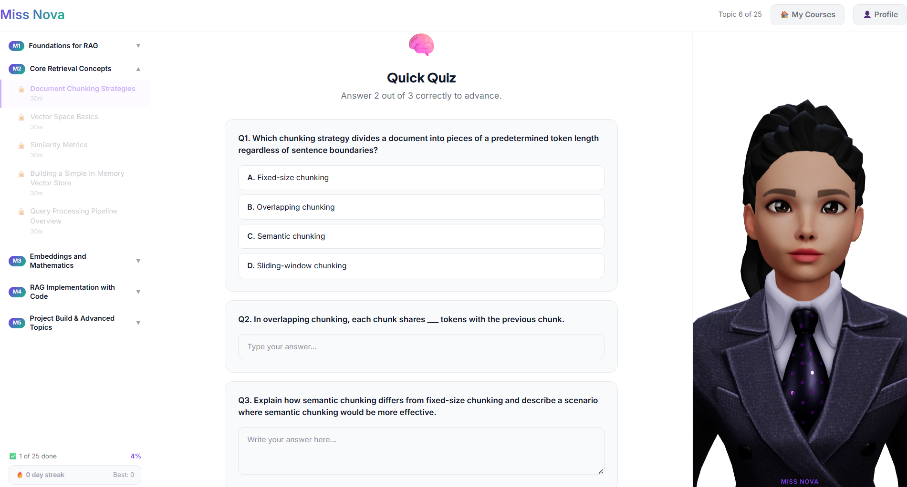
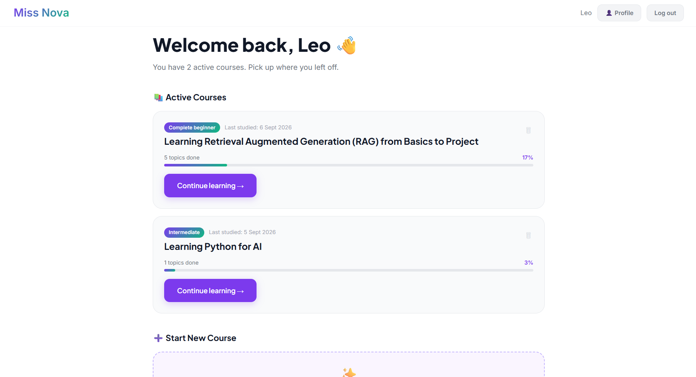
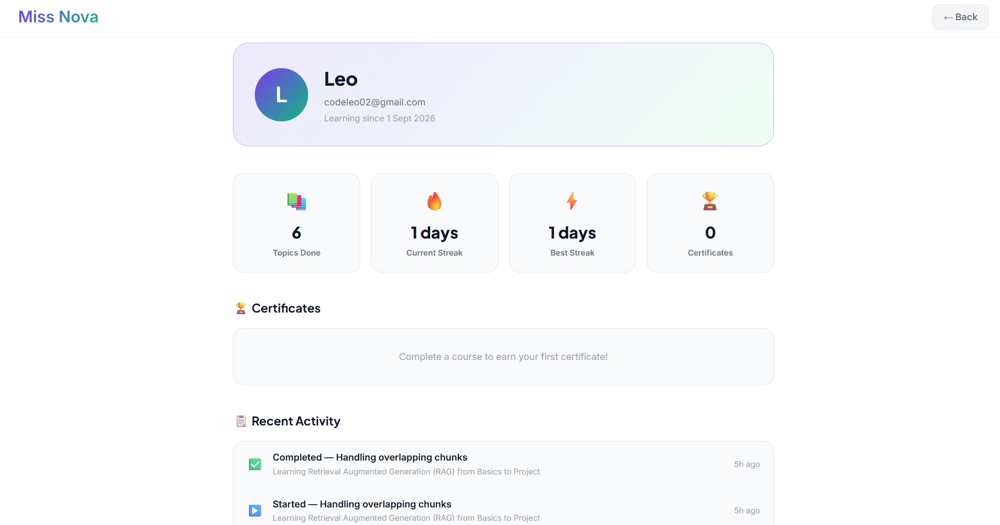

# Miss Nova — AI Learning Companion

> A full-stack AI tutor that generates personalized learning roadmaps and teaches each topic through a 3D talking avatar, interactive lessons, quizzes, and voice interaction.

**Live Demo → [3-d-ai-tutor.vercel.app](https://3-d-ai-tutor.vercel.app)**



---

## What it does

Miss Nova asks you 4 questions, then builds a personalized course roadmap — and teaches every topic herself, one subtopic at a time, with a 3D avatar that reacts to your progress.

- Answer 4 questions → get a custom AI-generated curriculum
- Learn through a structured flow: **Explain → Analogy → Code → Practice → Quiz**
- Miss Nova speaks every explanation aloud using Web Speech API
- Ask follow-up questions in natural language — she answers in context
- Fail a quiz → she re-explains only the concepts you got wrong
- Complete a course → earn a verifiable PDF certificate

---

## Screenshots

| Landing Page | Teaching Mode |
|---|---|
|  |  |

| Quiz | My Courses Dashboard |
|---|---|
|  |  |

| Certificate | Profile Page |
|---|---|
|  |  |

---

## Tech Stack

| Layer | Technology |
|---|---|
| Frontend | React 18 + Vite + Tailwind CSS v4 |
| 3D Avatar | Three.js + React Three Fiber + Ready Player Me GLB |
| LLM | Groq API — `openai/gpt-oss-120b` |
| TTS | Web Speech API (Google UK English Female) |
| Voice Input | Groq Whisper (`whisper-large-v3-turbo`) |
| Backend | FastAPI + Python 3.12 + uv |
| Database | Neon PostgreSQL |
| Auth | Supabase Auth |
| Payments | Razorpay (Rs. 1 real payment gate) |
| Code Editor | Monaco Editor (same as VS Code) |
| Diagrams | Kroki (Mermaid auto-generation) |
| In-browser Python | Pyodide (WebAssembly) |
| Hosting | Vercel (frontend) + Render (backend) |

---

## Architecture

```
User
 │
 ▼
React Frontend (Vercel)
 ├── LandingPage      → hero, 3D Nova speaks, public stats
 ├── AuthPage         → Supabase login / signup
 ├── MyCoursesPage    → up to 3 active courses, continue / delete
 ├── RoadmapBuilder   → 4-question onboarding wizard
 ├── BaselineAssess.  → 5 MCQ knowledge check → module skip
 ├── Prerequisites    → tool setup guide per subject
 ├── TopicView        → subtopic-aware teaching loop
 │    ├── Teaching    → explanation + analogy + code (Monaco)
 │    ├── Practice    → exercise + hints + evaluation
 │    ├── Quiz        → 3 questions + repair flow on fail
 │    └── Result      → per-question feedback + advance
 ├── ProfilePage      → stats, certificates, activity, confidence
 └── Avatar           → RPM 3D model, mood reactions, lipsync
          │
          ▼
FastAPI Backend (Render)
 ├── /api/roadmap          → generate personalized curriculum
 ├── /api/teach            → subtopic-aware lesson generation
 ├── /api/quiz/*           → generate + evaluate + repair
 ├── /api/practice/*       → exercise generation + evaluation
 ├── /api/baseline/*       → 5 MCQ assessment + level detection
 ├── /api/prerequisites    → tool setup guide
 ├── /api/transcribe       → Groq Whisper voice input
 ├── /api/payments/*       → Razorpay order + verify + promo codes
 ├── /api/progress/*       → save + load course progress (per subtopic)
 ├── /api/certificate/*    → PDF generation + QR code + verify page
 ├── /api/streak/*         → daily streak tracking
 ├── /api/confidence/*     → topic confidence + spaced repetition
 ├── /api/profile          → all user stats in one call
 └── /api/admin/*          → xAPI dashboard + student timelines
          │
          ▼
Neon PostgreSQL
 ├── sessions, courses, progress
 ├── payments, certificates
 ├── streaks, topic_confidence
 └── xapi_statements
```

---

## Key Features

### 🧠 AI Teaching System
- Subtopic-aware — Nova teaches one concept at a time, never dumps everything at once
- Dual Groq API key fallback — switches to backup key on rate limit (429)
- Robust JSON parser in every agent — handles trailing commas, control chars, truncated output
- Kroki diagrams — Nova auto-generates Mermaid diagrams for topics with flow or hierarchy

### 👩‍🏫 3D Avatar
- Ready Player Me GLB avatar loaded with React Three Fiber
- Mood-reactive — idle, explaining, thinking, happy, concerned states
- Fake viseme lipsync — mouth shapes cycle at speech rhythm while speaking
- Procedural eye blink and facial expression morph targets per mood

### 🎓 Learning Flow
- Baseline assessment — 5 MCQ on first launch, skips intro modules if already proficient
- Quiz repair — on fail, Nova re-explains only the specific concepts missed
- Spaced repetition — topics due for review shown with badge in sidebar
- Confidence rating — student rates each topic, drives review schedule

### 💳 Payments & Auth
- Supabase Auth — email/password login, persists across devices
- Razorpay payment gate after Module 1 (Rs. 1 real payment)
- Promo codes — `MISSNOVA100` for 100% off
- Payment status restored from DB on every login (no re-pay on refresh)

### 📜 Certificates
- PDF certificate generated with `reportlab` + QR code
- Public verify page at `/verify?code=UUID`
- LinkedIn "Add to Profile" pre-fill with one click

### 📊 Admin Dashboard
- xAPI learning statements recorded for every action
- Admin dashboard at `/admin` — student timelines, skip rate, time-on-task
- Public stats endpoint for landing page (learners + certificates)

---

## Local Setup

### Prerequisites
- Python 3.12 + `uv`
- Node.js 18+
- Neon PostgreSQL account (free)
- Groq API key (free)
- Supabase project (free)

### Backend

```bash
cd backend
uv sync
```

Create `backend/.env`:
```
GROQ_API_KEY_1=gsk_...
GROQ_API_KEY_2=gsk_...
DATABASE_URL=postgresql://...
ALLOWED_ORIGINS=http://localhost:5173
RAZORPAY_KEY_ID=rzp_test_...
RAZORPAY_KEY_SECRET=...
```

```bash
uv run uvicorn main:app --reload
```

Backend runs at `http://localhost:8000`. Swagger UI at `/docs`.

### Frontend

```bash
cd frontend
npm install
```

Create `frontend/.env`:
```
VITE_API_URL=http://localhost:8000/api
VITE_SUPABASE_URL=https://...supabase.co
VITE_SUPABASE_ANON_KEY=eyJ...
VITE_RAZORPAY_KEY_ID=rzp_test_...
```

```bash
npm run dev
```

Frontend runs at `http://localhost:5173`.

---

## Database Schema

```sql
sessions        (id, goal, level, created_at)
courses         (id, session_id, user_id, title, goal, level,
                 roadmap JSONB, is_completed, last_accessed, created_at)
progress        (id, session_id, course_id, completed_topics JSONB,
                 current_module, current_topic, current_subtopic, updated_at)
payments        (id, user_id UNIQUE, user_email, amount_paise,
                 promo_code, status, razorpay_order_id, paid_at)
certificates    (id, verify_code UUID, student_name, user_id,
                 course_title, completed_at)
streaks         (id, user_id UNIQUE, current_streak, best_streak, last_study_date)
topic_confidence(id, user_id, topic_key, confidence, last_reviewed, next_review)
xapi_statements (id, user_id, verb, object_type, object_id, object_name,
                 result_success, result_score, context_course,
                 context_module, context_subtopic, timestamp)
```

---

## Project Structure

```
3D-AI-Tutor/
├── frontend/
│   └── src/
│       ├── App.jsx                  # auth + routing + teaching mode
│       ├── components/
│       │   ├── Avatar.jsx           # RPM 3D avatar with mood + lipsync
│       │   ├── Sidebar.jsx          # module/topic nav with lock states
│       │   └── TopicView.jsx        # full teaching loop (6 phases)
│       ├── hooks/
│       │   ├── useCourseProgress.js # localStorage + Neon DB sync
│       │   └── useSpeech.js         # TTS + Whisper + cleanForSpeech()
│       └── pages/
│           ├── LandingPage.jsx      # public landing with live Nova
│           ├── AuthPage.jsx         # Supabase login/signup
│           ├── MyCoursesPage.jsx    # multi-course dashboard
│           ├── ProfilePage.jsx      # stats, certs, activity
│           ├── PaymentGate.jsx      # Razorpay + promo codes
│           ├── BaselineAssessment.jsx
│           └── AdminPage.jsx        # password-protected dashboard
│
└── backend/
    ├── main.py                      # FastAPI + CORS + all routers
    ├── agents/
    │   ├── roadmap_agent.py         # curriculum generation
    │   ├── teaching_agent.py        # subtopic-aware lesson + Kroki
    │   ├── quiz_agent.py            # generate + evaluate + repair
    │   ├── baseline_agent.py        # 5 MCQ assessment
    │   └── prerequisites_agent.py   # tool setup guide
    └── routes/
        ├── teaching.py              # teach + quiz + practice + progress
        ├── payments.py              # Razorpay + promo codes
        ├── certificate.py           # PDF + QR + verify
        ├── courses.py               # CRUD for user courses
        ├── profile.py               # all user stats in one endpoint
        ├── streak.py                # daily streak
        ├── confidence.py            # spaced repetition
        └── xapi.py                  # learning analytics + admin
```

---

## What I learned building this

- **WebGL avatar rendering on Intel UHD GPU** requires special handling — separate GLB files for model and animations, `React.memo` on the Canvas wrapper with refs for values that change frequently to prevent Canvas remounts
- **LLM JSON reliability** — `gpt-oss-120b` produces malformed JSON on large responses. Every agent needs `response_format={"type": "json_object"}`, increased `max_tokens`, and a `robust_parse()` function with regex sanitization
- **TTS symbol stripping** — Web Speech API reads backticks, underscores and arrows literally. A `cleanForSpeech()` function must strip all markdown before passing text to the synthesizer
- **Stale closure bugs** — React state captured in payment callbacks was always `false`. Fix: use `useRef` alongside `useState` for values read inside event handlers
- **Subtopic resume** — saving progress at topic level isn't enough. Full resume requires tracking `current_subtopic` in the DB and saving it both on navigation and on page leave

---

## Author

Built by **Leo** — [GitHub](https://github.com/codewithleo1)

---

*Miss Nova is a portfolio project demonstrating full-stack AI application development.*
